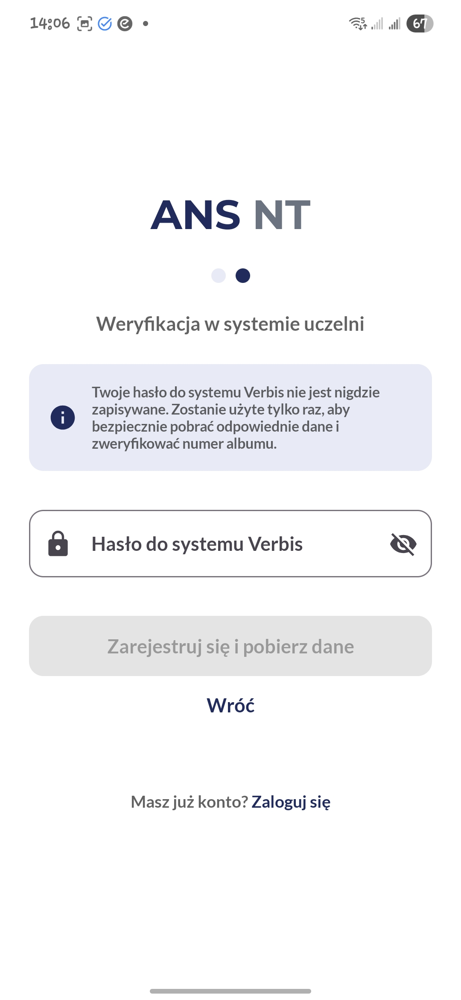
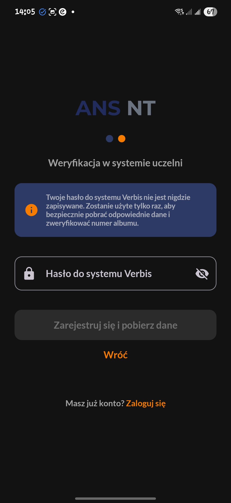
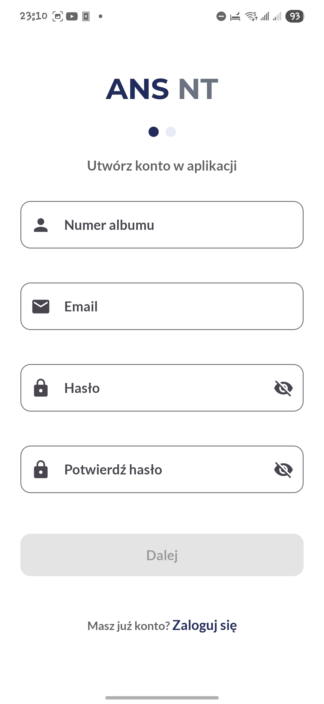
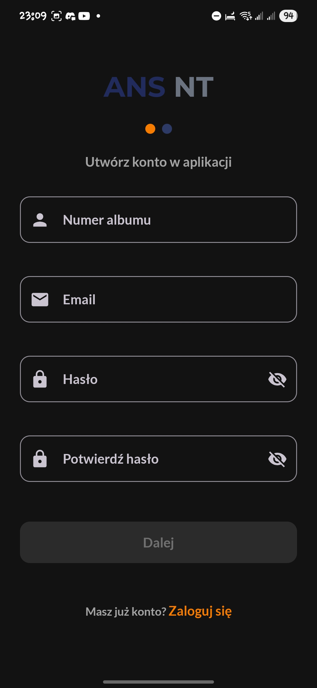
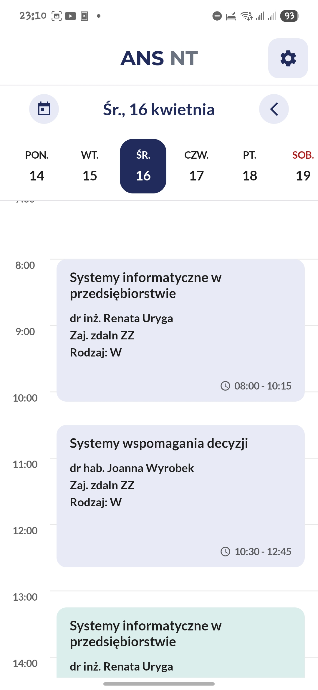
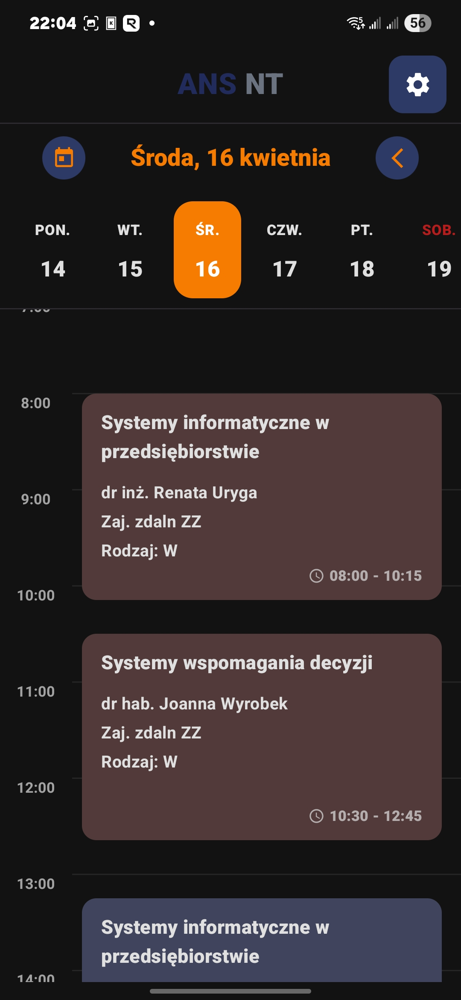
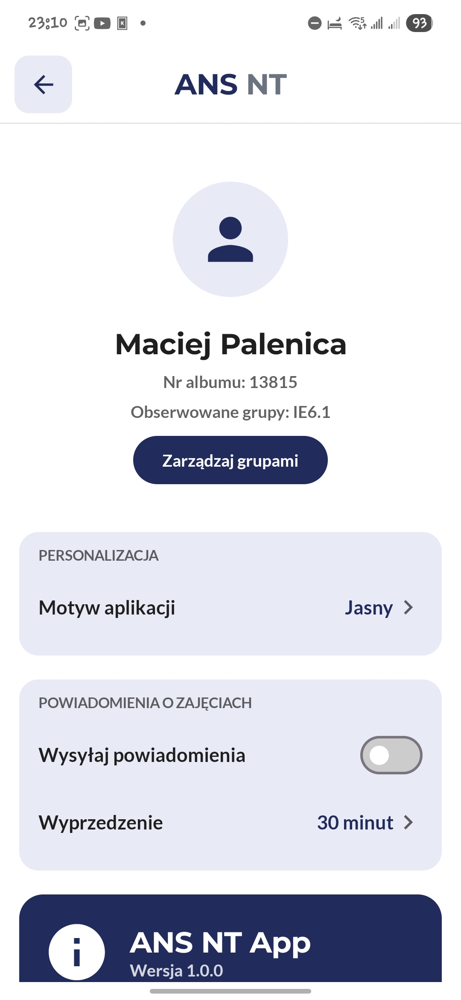
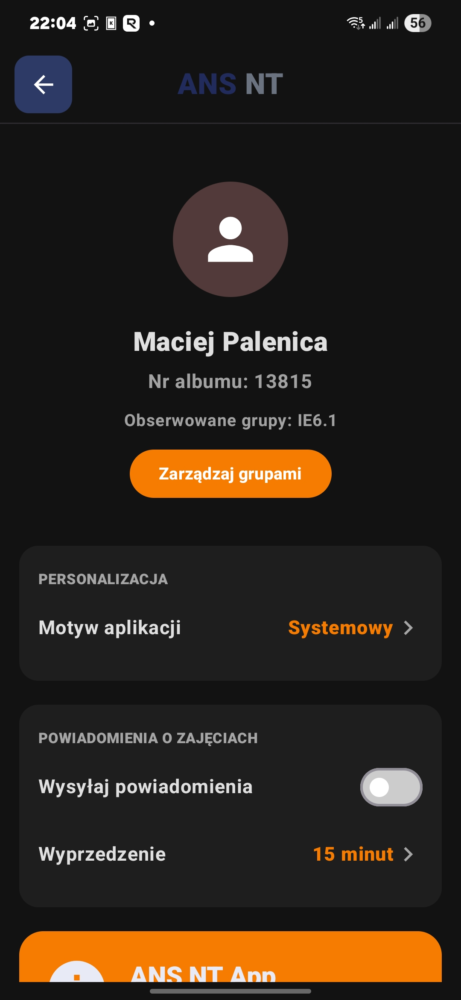

# 📱 ANS MOBILE

`ANS MOBILE` is an unofficial mobile application created for students, allowing convenient viewing of class schedules directly from the Verbis system on mobile devices. The application offers additional features, such as notifications and tracking multiple groups, to help organize studies.

---

## ✨ Key Features

* **Schedule Viewing:** Quick and clear access to your timetable.
* **Multi-Group Tracking:** Ideal for students who attend classes with different groups or want to coordinate schedules with friends.
* **Smart Notifications:** Receive reminders about upcoming classes:
    * 15 minutes before
    * 30 minutes before
    * 1 hour before
    * 2 hours before
* **Light & Dark Mode:** The app automatically adapts to your system theme or allows manual selection.

---

## ⚙️ How It Works

The application does not connect directly to the Verbis system every time. To ensure speed, reliability, and notification support, `ans mobile` communicates with a dedicated **backend (Firebase)**.

This backend is responsible for securely fetching, processing, and caching data from the Verbis system, and then providing it to the mobile app in an optimized way.

---

## 🔒 Registration and Login

To use the app, creating an account is required. This process ensures personalization and data security.

1.  **Registration:** The user creates an account within the app.
2.  **Identity Verification:** During registration, you will be asked to provide your **student ID number (numer albumu)** and your **Verbis system password**.
    > **Important:** The Verbis password is used **only once** to confirm your identity and link your app account to your schedule. It is not stored.
3.  **Login:** After successful registration and verification, you can log in to the app using the student ID number and the password provided during registration.

## 🌍 Localization

At the moment, `ANS MOBILE` is only available in **Polish (🇵🇱)**.

## 📸 App Preview

| Feature | Light Mode | Dark Mode |
| :---: | :---: | :---: |
| **Login** |  |  |
| **Registration** |  |  |
| **Schedule** |  |  |
| **Settings** |  |  |
